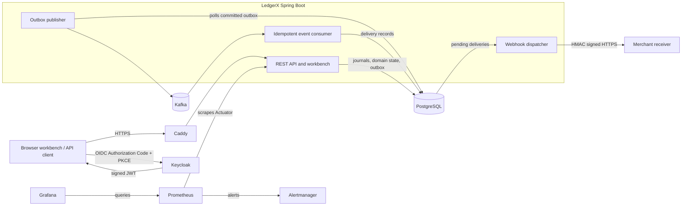
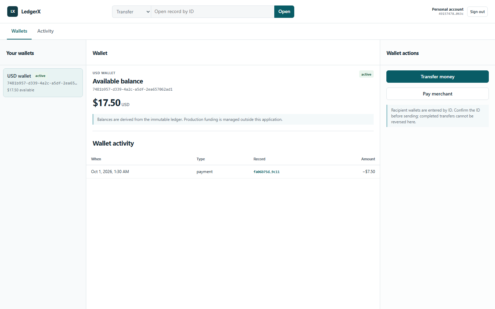
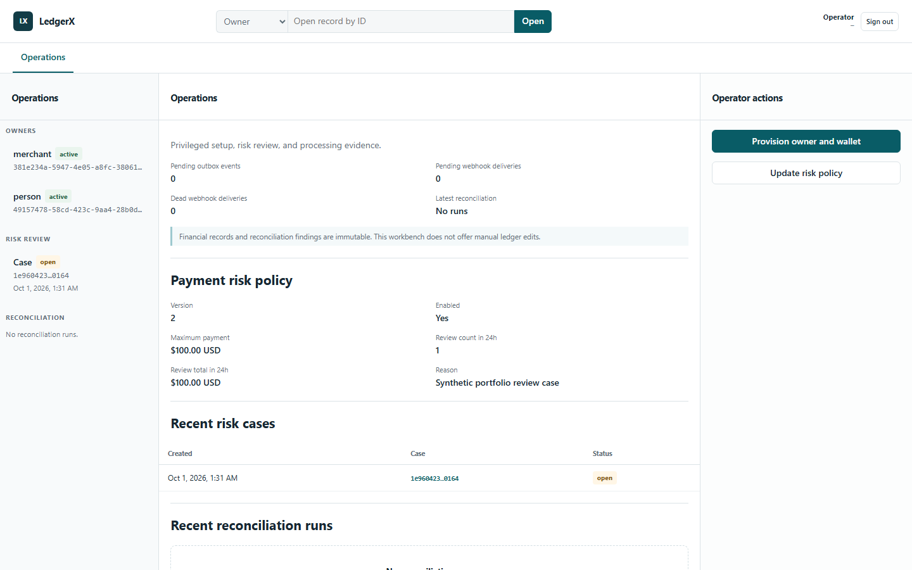

# LedgerX

[](https://github.com/Omar-Mega-Byte/LedgerX/actions/workflows/verify.yml)

**A Java 21 / Spring Boot financial ledger and wallet application.** LedgerX models USD transfers, merchant payments, and refunds on an immutable double-entry journal. It uses PostgreSQL for committed financial state, a transactional outbox and Kafka for downstream events, Keycloak for production identity, and a browser workbench for owner and operator workflows.

**Status:** The core system, Docker Compose configurations, automated verification, and a single-host deployment are implemented. [Live acceptance on 2026-09-29](docs/acceptance-2026-09-29.md) exercised public TLS, real sign-in, money movement, webhook retries, monitoring, and backup restore. Unattended backups, a durable external alert receiver, restored Keycloak login, a full cutover drill, and measured RPO/RTO remain open. LedgerX is a learning and portfolio project; it does not process real deposits or card credentials.

## What this project demonstrates

| Area | Implemented work |
| --- | --- |
| Financial modeling | USD money values, wallet ownership, balanced append-only journals, derived balances, compensating refunds, and PostgreSQL integrity guards |
| Correctness under retries | Owner-scoped idempotency keys, ordered row locks, concurrency tests, and an outbox committed with payment and refund state |
| Distributed effects | Kafka publication, consumer deduplication, merchant webhook HMAC signatures, bounded retries, replay, and delivery evidence |
| Security and operations | Keycloak JWT issuer/audience checks, signed owner claims, operator role checks, reconciliation findings, metrics, alerts, and backup/restore scripts |
| Verification | JUnit and Spring tests, PostgreSQL/Kafka Testcontainers, real-Keycloak Chromium flows, PowerShell backup tests, and GitHub Actions |

## Architecture

LedgerX is a modular monolith. The workbench is served from the Spring Boot JAR; there is no separate frontend service. PostgreSQL is the financial source of truth. Kafka carries events after the database transaction commits.



The `prod` profile requires Keycloak access tokens with the configured issuer and `ledgerx-api` audience. A signed `ledgerx_owner_id` claim selects the wallet owner; the `ledgerx-operator` realm role gates provisioning, risk review, and reconciliation APIs. The local/test owner header is a **forgeable development seam**, not authentication. [Architecture and invariants](docs/architecture.md) · [Security configuration](docs/configuration.md)

## Capabilities and design choices

| Domain | Capability and reason for the design |
| --- | --- |
| Ledger and wallets | PERSON and MERCHANT owners have USD wallets. Balances derive from immutable debit/credit entries, so a mutable balance field cannot silently diverge from the journal. |
| Transfers | Owner-authorized, idempotent wallet transfers use ordered locks and a single balanced posting; insufficient funds do not create a completed transfer. |
| Payments and refunds | Payer-authorized PERSON-to-MERCHANT payments and merchant-authorized partial/full refunds use compensating journals. A database guard prevents cumulative over-refunds, including concurrent attempts. |
| Risk | Versioned amount and 24-hour velocity rules can allow, block, or queue a payment for operator review. A review or approval moves no money; only the original payer can retry an approved request. The initial policy is disabled. |
| Events and webhooks | The outbox closes the database/broker write gap. Consumers deduplicate events; merchant endpoints receive signed payment/refund webhooks with leased retries, replay, and immutable attempt history. Signing secrets are encrypted with versioned key support. |
| Operations | Operator APIs expose owner setup, reconciliation runs/findings, risk cases, outbox replay, and key rotation. Actuator, Prometheus, Grafana, Alertmanager, and PowerShell backup/restore tooling support operation and recovery. |

Flyway migrations are forward-only. Financial corrections create new entries; the workbench has no manual ledger-edit action. [Event operations](docs/event-operations.md) · [Backup and recovery](docs/disaster-recovery.md)

## Workbench

These screenshots come from the isolated real-Keycloak Chromium test with synthetic owners and transactions. No production account or credential appears in them. Run `E2E_CAPTURE_PORTFOLIO=1 npm run test:e2e` (PowerShell: `$env:E2E_CAPTURE_PORTFOLIO='1'; npm run test:e2e`) to regenerate the workbench images.

**Owner wallet:** derived USD balance, recent activity, and transfer/payment actions.



**Operator workbench:** owner list, processing evidence, active risk policy, and review queue.



[Sign-in](docs/images/sign-in.png) · [Merchant payment](docs/images/merchant-payment.png) · [Partial refund](docs/images/partial-refund.png) · [Risk case detail](docs/images/risk-review.png) · [Interactive API reference](docs/images/api-reference.png)

## API

The REST API is rooted at `/api/v1`. Owner routes include `GET /me`, paged `GET /activity`, transfers, payments, refunds, journal lookup, payment risk cases, and merchant webhook endpoint/delivery management. Role-gated `/operations/**` routes cover owner provisioning, risk policy/review, reconciliation evidence, outbox replay, and webhook key rotation. New financial commands require `Idempotency-Key`; an identical retry returns the stored result.

In local mode, the API and [Swagger UI](http://127.0.0.1:8080/swagger-ui/index.html) are at `http://127.0.0.1:8080`; the machine-readable specification is `/api-docs`. Swagger is disabled in the `prod` profile. Production clients use `Authorization: Bearer <JWT_TOKEN>` obtained through Keycloak Authorization Code with PKCE. See the [API guide](docs/api.md) for route groups, authentication boundaries, request/response examples, and status codes.

## Stack and verification

| Layer | Technologies |
| --- | --- |
| Backend | Java 21, Spring Boot, Spring Security, Spring Data JPA/Hibernate, Maven |
| Data and messaging | PostgreSQL, Flyway, Apache Kafka |
| Identity and edge | Keycloak OIDC/JWT, Caddy HTTPS, HMAC-SHA-256 webhooks |
| Workbench | Same-origin HTML/CSS/JavaScript modules with TypeScript JSDoc checks |
| Operations | Docker Compose, Actuator, Prometheus, Grafana, Alertmanager, PowerShell backup/restore, rclone off-host replication |
| Tests and CI | JUnit 5, Mockito, Spring Boot Test, Testcontainers, Playwright Chromium, GitHub Actions |

`mvnw verify` runs unit tests and Docker-backed integration tests, including database constraints, API authorization, idempotency, concurrency, Kafka/outbox, and webhook behavior. On 2026-10-01, a clean local run passed **46 unit and 77 integration tests**; the isolated Chromium suite passed **2 scenarios**. CI also checks workbench types and documentation links, validates production Compose, runs backup-script tests, and executes the real-Keycloak browser suite. The [development guide](docs/development.md) covers test scope and prerequisites.

## Run locally

Install Git, Docker Desktop, Java 21, and Node.js 24 for UI checks. The Maven Wrapper is included. From a clone:

```powershell
git clone https://github.com/Omar-Mega-Byte/LedgerX.git
cd LedgerX
docker compose -p ledgerx-dev up -d --build --wait
docker compose -p ledgerx-dev ps
```

Open `http://127.0.0.1:8080/` for the workbench, `http://127.0.0.1:8080/actuator/health` for health, or the local Swagger UI above. The local profile uses an owner UUID header for test data; it does not provide public self-registration. The [development guide](docs/development.md) shows how to seed disposable local owners and wallets; the production-profile operator workflow provisions real owner records. Local demo top-up is available after a wallet exists and writes a balanced test-money journal. It is absent from production.

Run verification:

```powershell
.\mvnw.cmd verify
npm ci
npm run check:ui
npm run test:e2e
.\scripts\tests\backup-offhost.Tests.ps1
```

The Maven and browser suites require Docker. On Windows, if Maven cannot write its default cache, use `./mvnw.cmd --% -Dmaven.repo.local=<writable-cache-path> clean verify`. The browser suite creates and removes its own production-profile Compose project. The local stack can be stopped with `docker compose -p ledgerx-dev down`; omit `--volumes` to retain local data. [Configuration template](.env.example) · [Development guide](docs/development.md)

## Deployment and project status

The included [production Compose file](compose.production.yaml) places PostgreSQL, Kafka, Keycloak, and the API on private networks; only Caddy exposes public HTTP/HTTPS. Monitoring UIs bind to loopback. The [deployment guide](docs/production-deployment.md) covers secrets, realm reconciliation, and acceptance checks. Repository tests and Compose validation establish configuration behavior; the [dated live acceptance record](docs/acceptance-2026-09-29.md) states what was observed on one deployment and what still needs an operational drill. Multi-host availability and capacity are outside the verified scope.

**CV summary:** Built a Java 21/Spring Boot USD ledger with immutable double-entry posting, idempotent transfers and merchant payments, PostgreSQL refund guards, Kafka outbox delivery, Keycloak owner/operator authorization, signed webhooks, Dockerized deployment, and integration/browser verification.

## Repository guide

`src/main` contains the backend, Flyway migrations, and static workbench; `src/test` and `tests/e2e` contain verification. `keycloak/`, `monitoring/`, the Compose files, and `scripts/` contain deployment and recovery assets. Current technical guides are under [`docs/`](docs/); historical design records are in [`docs/history/`](docs/history/).

No license has been selected yet.
